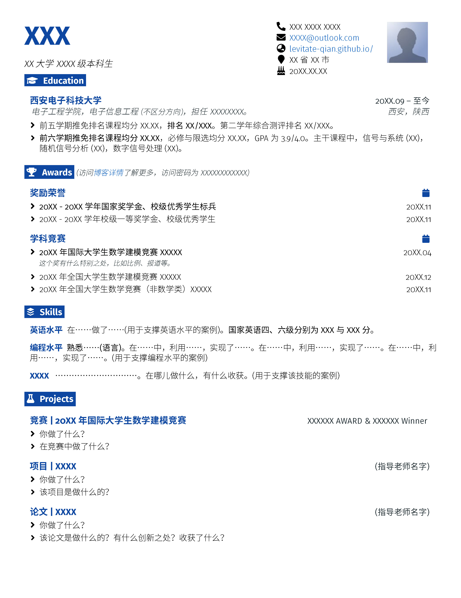
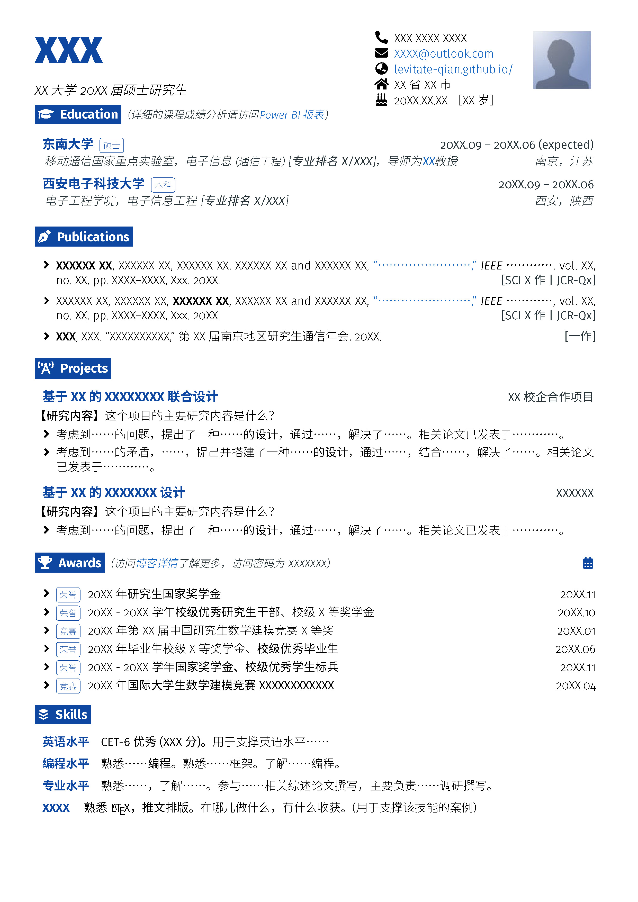
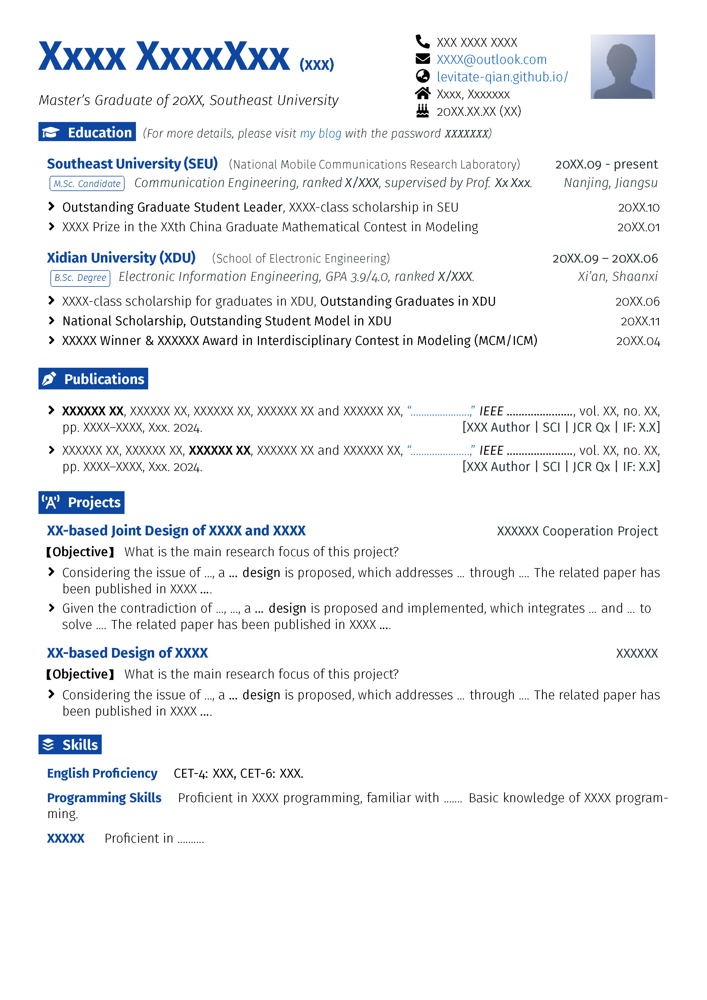

# 保研/求职latex简历模版
> 该模版修改自“[GitHub - lcfyi/software-resume-template: A simple LaTeX template for software engineering resumes.](https://github.com/lcfyi/software-resume-template)” 。
>
> + 增加了对中文的支持；
> + 增加了照片的放置；
> + 提供了更适用于国内保研/求职的模块。

这里主要提供三个模版：

+ `Resume_UG_Recommendation.tex`：修改自本科保研期间的简历模版
  
+ `Resume_job_CN.tex`：修改自研究生找工作期间的简历模版（中文版，也改了各种各样的版本）
  
+ `Resume_job_EN.tex`：修改自研究生找工作期间的简历模版（英文版，其实没怎么用，就当时投微软用了一下，但也没啥下文）
  

## 相关使用说明

+ 理论上应该下载下来直接可以使用，目前在MacTeX/Overleaf上使用XeLaTeX运行没有问题。但是中文字体部分请参照第二部分。
+ “Header settings”主要定义顶部姓名、副标题、个人信息和照片等部分。可以通过更换`\faPhone*`等来更换小图标，请参考`fontawesome5`宏包（本地用户可以直接`texdoc fontawesome5`）。照片直接更换根目录下的`photo.jpg`即可。
+ 找工作的两个模版中“Custom commands”中新定义了`\button`命令，主要用于显示带圆角方框的略微缩小的文字（其实并不是button啦，只是长得有点像）
+ 该模版中重定义了`\section`包含三个参数，第一个放置图标、第二个为标题名称、第三个用于加入一些小字注解。
+ 剩余的部分可以根据不同的模块选择不同的列表样式，基本都是修改自原模版的。

## 字体相关

建议下载`fonts`文件夹（[蓝奏云链接🔗](https://levitate.lanzoub.com/iecax2rekcde)下载可能更快一些），并将其放置在这个文件所在的目录下。

+ 目前配置的字体均为非衬线体，西文部分使用*FiraSans*（在TeX中已经包含），中文部分采用思源黑体 CN+江城斜黑体（也就是上述链接中提供的字体，均为免费商用字体）。

+ 理论上，注释掉tex文件中定义字体的部分，直接编译也能编译成功，只是可能中西文匹配不是那么美观。具体注释方式如下：
  + `Resume_UG_Recommendation.tex`： 注释第30-37行，取消注释40行；
  + `Resume_job_CN.tex`：注释第33-43行，取消注释第47-51行；如果已经本地安装了上述字体，可以直接使用第54-59行的命令，而不需要`fonts`文件夹。
  + `Resume_job_EN.tex`：不需要注释即可编译成功，但是安装相关字体后，取消注释33-37行可以获得更好的中文名字显示效果。

